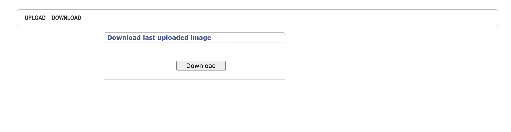

# DApp

This projects represents a simple DApp that get binary file frome user and upload it to an IPFS node. Hash of uploaded cid is stored in simple smart-contract containing mapping and allowing to map address of sender to cid of binary file they are to upload and get cid by this address (address => ipfs_hash). Frontend of project allows to preview file to upload and to demonstrate downloaded file in browser. The project works on local dev-versions of software, but can be configured to work on remote machines. 

## Building and running:

Let's start with deploying contract locally. In root directory of project make following steps:
```
npm i
npx hardhat run --network localhost scripts/deploy.js
```

Here we have first information for frontend configuration from logs: address of contract and address of signer:


You also get info where your server started at. By default, it is ```http://127.0.0.1:8545/```:


Let's move on to starting ipfs node. After [installing](https://docs.ipfs.tech) and initializing it with ```ipfs init``` command, we have configuration file with JSON. Change it by adding this member to the object:
```
"API": {
    "HTTPHeaders": {
      "Access-Control-Allow-Methods": [
        "GET",
        "POST"
      ],
      "Access-Control-Allow-Origin": [
        "*"
      ]
    }
  },
```

Then run daemon: 
```
ipfs daemon
```

Here we get to know where API server is listening:


Finally, we should configure frontend. 
```
cd frontend 
npm i
```
In ```.env``` file add fill it with 4 variables with values we discussed above:
```
VUE_APP_IPFS_API_SERVER_URL
VUE_APP_PROVIDER_URL
VUE_APP_CONTRACT_ADDRESS6B896A8C5b
VUE_APP_SIGNER_ADDRESS
```
Then build and run:
```
npm run build
serve -s dist
```

Your local address was copied to clipboard.

There are two pages in app. One is to upload, another - to download.




Minimal validation corresponds to what tests check:


App accepts ```.jpeg``` and ```.png``` files, shows preview before uploading and displays the download file on the screen:


For tests run in project's root:
```
npx hardhat test
```

## Logging output:

```
IPFS
    ✔ Should not get cid before uploaded (754ms)
    ✔ Should get cid after uploaded


  2 passing (771ms)
```